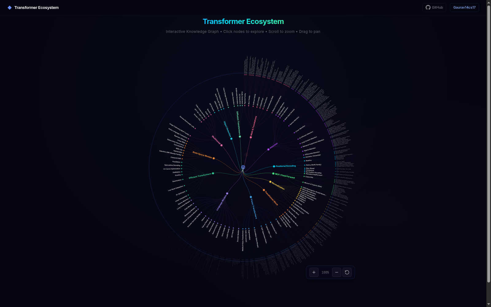

# Transformer-Ecosystem 

[](https://gaurav14cs17.github.io/Transformer-Ecosystem/)
[](LICENSE)
[](https://github.com/Gaurav14cs17)

A comprehensive map of the transformer ecosystem — building blocks, architectures, and their foundational papers — organized by category and sorted chronologically.

## Live Interactive Website

**[→ Open Interactive Explorer ←](https://gaurav14cs17.github.io/Transformer-Ecosystem/)**

Click any node to navigate through the hierarchy. Scroll to zoom, drag to pan.

[](https://gaurav14cs17.github.io/Transformer-Ecosystem/)

---

## Table of Contents

- [00 Math & Foundations](#00-math--foundations)
- [01 Attention](#01-attention)
- [02 Positional Encoding](#02-positional-encoding)
- [03 MLP / Feed Forward](#03-mlp--feed-forward)
- [04 Normalization](#04-normalization)
- [05 Transformer Block](#05-transformer-block)
- [06 Vision Transformers](#06-vision-transformers)
- [07 Language Models](#07-language-models)
- [08 Efficient Transformers](#08-efficient-transformers)
- [09 State Space Models](#09-state-space-models)
- [10 Multimodal](#10-multimodal)
- [11 Object Detection](#11-object-detection)
- [12 Diffusion Transformers](#12-diffusion-transformers)
- [13 Decoding](#13-decoding)
- [References (Continuously Updated)](#references-continuously-updated)

---

## 00 Math & Foundations

### Sigmoid Family

| Paper | Year | Month | Link |
|-------|------|-------|------|
| Sigmoid Function (Logistic Function) | 1845 | — | [Wikipedia](https://en.wikipedia.org/wiki/Sigmoid_function) |
| Swish: A Self-Gated Activation Function | 2017 | Oct | [arXiv](https://arxiv.org/abs/1710.05941) |
| Mish: A Self Regularized Non-Monotonic Activation Function | 2019 | Aug | [arXiv](https://arxiv.org/abs/1908.08681) |

### ReLU Family

| Paper | Year | Month | Link |
|-------|------|-------|------|
| Rectified Linear Units Improve Restricted Boltzmann Machines (ReLU) | 2010 | — | [ICML](https://www.cs.toronto.edu/~hinton/absps/reluICML.pdf) |
| Rectifier Nonlinearities Improve Neural Network Acoustic Models (Leaky ReLU) | 2013 | Jun | [ICML](https://ai.stanford.edu/~amaas/papers/relu_hybrid_icml2013_final.pdf) |
| Delving Deep into Rectifiers (PReLU) | 2015 | Feb | [arXiv](https://arxiv.org/abs/1502.01852) |
| Fast and Accurate Deep Network Learning by Exponential Linear Units (ELU) | 2015 | Nov | [arXiv](https://arxiv.org/abs/1511.07289) |
| Self-Normalizing Neural Networks (SELU) | 2017 | Jun | [arXiv](https://arxiv.org/abs/1706.02515) |

### Softmax Family

| Paper | Year | Month | Link |
|-------|------|-------|------|
| Attention Is All You Need (Softmax in Attention) | 2017 | Jun | [arXiv](https://arxiv.org/abs/1706.03762) |
| Sparse Softmax: Sparse and Continuous Attention Mechanisms | 2018 | May | [arXiv](https://arxiv.org/abs/1805.04106) |
| Log-Softmax | 2019 | — | [PyTorch Docs](https://pytorch.org/docs/stable/generated/torch.nn.LogSoftmax.html) |
| Softmax1: Safe Softmax — A Debiased Softmax | 2023 | Oct | [arXiv](https://arxiv.org/abs/2310.03430) |
| Quiet Attention (QA-Softmax) | 2024 | Mar | [arXiv](https://arxiv.org/abs/2403.01643) |

### GELU Family

| Paper | Year | Month | Link |
|-------|------|-------|------|
| Gaussian Error Linear Units (GELUs) | 2016 | Jun | [arXiv](https://arxiv.org/abs/1606.08415) |
| Sigmoid Linear Unit (SiLU / Swish) | 2017 | Oct | [arXiv](https://arxiv.org/abs/1710.05941) |
| GLU Variants Improve Transformer (GEGLU, SwiGLU) | 2020 | Feb | [arXiv](https://arxiv.org/abs/2002.05202) |

### Embeddings

| Paper | Year | Month | Link |
|-------|------|-------|------|
| Efficient Estimation of Word Representations in Vector Space (Word2Vec) | 2013 | Jan | [arXiv](https://arxiv.org/abs/1301.3781) |
| Attention Is All You Need (Token Embedding) | 2017 | Jun | [arXiv](https://arxiv.org/abs/1706.03762) |
| An Image is Worth 16x16 Words (Patch Embedding) | 2020 | Oct | [arXiv](https://arxiv.org/abs/2010.11929) |

### Loss Functions

| Paper | Year | Month | Link |
|-------|------|-------|------|
| Cross-Entropy Loss | — | — | [Wikipedia](https://en.wikipedia.org/wiki/Cross-entropy) |
| Approximating the Kullback Leibler Divergence (KL Divergence) | — | — | [Wikipedia](https://en.wikipedia.org/wiki/Kullback%E2%80%93Leibler_divergence) |
| A Simple Framework for Contrastive Learning (SimCLR Contrastive Loss) | 2020 | Feb | [arXiv](https://arxiv.org/abs/2002.05709) |

### Normalization Math

| Paper | Year | Month | Link |
|-------|------|-------|------|
| Batch Normalization: Accelerating Deep Network Training | 2015 | Mar | [arXiv](https://arxiv.org/abs/1502.03167) |
| Layer Normalization | 2016 | Jul | [arXiv](https://arxiv.org/abs/1607.06450) |
| Group Normalization | 2018 | Mar | [arXiv](https://arxiv.org/abs/1803.08494) |
| Root Mean Square Layer Normalization (RMSNorm) | 2019 | Oct | [arXiv](https://arxiv.org/abs/1910.07467) |
| Transformers without Tears (ScaleNorm) | 2019 | Oct | [arXiv](https://arxiv.org/abs/1910.05895) |
| DeepNet: Scaling Transformers to 1,000 Layers (DeepNorm) | 2022 | Mar | [arXiv](https://arxiv.org/abs/2203.00555) |

### Rotary & Positional Math

| Paper | Year | Month | Link |
|-------|------|-------|------|
| Attention Is All You Need (Sinusoidal PE) | 2017 | Jun | [arXiv](https://arxiv.org/abs/1706.03762) |
| Self-Attention with Relative Position Representations | 2018 | Mar | [arXiv](https://arxiv.org/abs/1803.02155) |
| RoFormer: Enhanced Transformer with Rotary Position Embedding (RoPE) | 2021 | Apr | [arXiv](https://arxiv.org/abs/2104.09864) |
| Train Short, Test Long: Attention with Linear Biases (ALiBi) | 2021 | Aug | [arXiv](https://arxiv.org/abs/2108.12409) |
| A Length-Extrapolatable Transformer (xPos) | 2022 | Dec | [arXiv](https://arxiv.org/abs/2212.10554) |
| YaRN: Efficient Context Window Extension of Large Language Models | 2023 | Aug | [arXiv](https://arxiv.org/abs/2309.00071) |
| LongRoPE: Extending LLM Context Window Beyond 2 Million Tokens | 2024 | Feb | [arXiv](https://arxiv.org/abs/2402.13753) |

---

## 01 Attention

### Classical Attention

| Paper | Year | Month | Link |
|-------|------|-------|------|
| Neural Machine Translation by Jointly Learning to Align and Translate (Bahdanau / Additive) | 2014 | Sep | [arXiv](https://arxiv.org/abs/1409.0473) |
| Effective Approaches to Attention-based Neural Machine Translation (Luong / Dot-Product) | 2015 | Aug | [arXiv](https://arxiv.org/abs/1508.04025) |
| Attention Is All You Need (Scaled Dot-Product) | 2017 | Jun | [arXiv](https://arxiv.org/abs/1706.03762) |

### Self-Attention

| Paper | Year | Month | Link |
|-------|------|-------|------|
| Attention Is All You Need | 2017 | Jun | [arXiv](https://arxiv.org/abs/1706.03762) |

### Cross-Attention

| Paper | Year | Month | Link |
|-------|------|-------|------|
| Attention Is All You Need | 2017 | Jun | [arXiv](https://arxiv.org/abs/1706.03762) |
| Perceiver: General Perception with Iterative Attention | 2021 | Mar | [arXiv](https://arxiv.org/abs/2103.03206) |
| Perceiver IO: A General Architecture for Structured Inputs & Outputs | 2021 | Jul | [arXiv](https://arxiv.org/abs/2107.14795) |

### Multi-Head Variants

| Paper | Year | Month | Link |
|-------|------|-------|------|
| Attention Is All You Need (Multi-Head Attention) | 2017 | Jun | [arXiv](https://arxiv.org/abs/1706.03762) |
| Fast Transformer Decoding: One Write-Head is All You Need (Multi-Query) | 2019 | Nov | [arXiv](https://arxiv.org/abs/1911.02150) |
| Talking-Heads Attention | 2020 | Mar | [arXiv](https://arxiv.org/abs/2003.02436) |
| GQA: Training Generalized Multi-Query Transformer Models (Grouped-Query) | 2023 | May | [arXiv](https://arxiv.org/abs/2305.13245) |
| DeepSeek-V2: A Strong, Economical, and Efficient MoE LM (Multi-Latent Attention) | 2024 | May | [arXiv](https://arxiv.org/abs/2405.04434) |
| LUCID: Attention with Preconditioned Representations | 2026 | Feb | [arXiv](https://arxiv.org/abs/2602.10410) |
| Affine-Scaled Attention: Towards Flexible and Stable Transformer Attention | 2026 | Feb | [arXiv](https://arxiv.org/abs/2602.23057) |
| Keyless Attention: Value-Space Routing and Value-Only Caching | 2026 | Jun | [arXiv](https://arxiv.org/abs/2606.21848) |

### Sparse Attention

| Paper | Year | Month | Link |
|-------|------|-------|------|
| Image Transformer (Local Attention) | 2018 | Feb | [arXiv](https://arxiv.org/abs/1802.05751) |
| Generating Long Sequences with Sparse Transformers | 2019 | Apr | [arXiv](https://arxiv.org/abs/1904.10509) |
| Longformer: The Long-Document Transformer (Sliding Window + Global) | 2020 | Apr | [arXiv](https://arxiv.org/abs/2004.05150) |
| LongNet: Scaling Transformers to 1,000,000,000 Tokens (Dilated) | 2023 | Jul | [arXiv](https://arxiv.org/abs/2307.02486) |
| Mistral 7B (Sliding Window) | 2023 | Oct | [arXiv](https://arxiv.org/abs/2310.06825) |
| Native Sparse Attention: Hardware-Aligned and Natively Trainable Sparse Attention (NSA) | 2025 | Feb | [arXiv](https://arxiv.org/abs/2502.11089) |
| Gated Attention for Large Language Models: Non-linearity, Sparsity, and Attention-Sink-Free | 2025 | May | [arXiv](https://arxiv.org/abs/2505.06708) |
| DashAttention: Differentiable and Adaptive Sparse Hierarchical Attention | 2025 | May | [arXiv](https://arxiv.org/abs/2605.18753) |
| SparDA: Sparse Decoupled Attention for Efficient Long-Context LLM Inference | 2026 | Jun | [arXiv](https://arxiv.org/abs/2606.04511) |

### Linear Attention

| Paper | Year | Month | Link |
|-------|------|-------|------|
| Transformers are RNNs: Fast Autoregressive Transformers with Linear Attention | 2020 | Jun | [arXiv](https://arxiv.org/abs/2006.16236) |
| Rethinking Attention with Performers (FAVOR+) | 2020 | Sep | [arXiv](https://arxiv.org/abs/2009.14794) |
| Linformer: Self-Attention with Linear Complexity | 2020 | Jun | [arXiv](https://arxiv.org/abs/2006.04768) |
| Nyströmformer: A Nyström-Based Algorithm for Approximating Self-Attention | 2021 | Feb | [arXiv](https://arxiv.org/abs/2102.03902) |
| Reformer: The Efficient Transformer (LSH Attention) | 2020 | Jan | [arXiv](https://arxiv.org/abs/2001.04451) |
| CosFormer: Rethinking Softmax in Attention | 2022 | Feb | [arXiv](https://arxiv.org/abs/2202.08791) |
| DeltaNet: Conditional State Space Models with Selective Retrieval | 2024 | Jun | [arXiv](https://arxiv.org/abs/2406.06484) |
| Gated Linear Attention Transformers with Hardware-Efficient Training (GLA) | 2024 | May | [arXiv](https://arxiv.org/abs/2312.06635) |
| Based: Simple Linear Attention Language Models Balance the Recall-Throughput Tradeoff | 2024 | Feb | [arXiv](https://arxiv.org/abs/2402.18668) |
| Lightning Attention-2: A Free Lunch for Handling Unlimited Sequence Lengths | 2024 | Jan | [arXiv](https://arxiv.org/abs/2401.04658) |
| Kimi-VL Technical Report (Kimi Linear Attention) | 2024 | — | [Moonshot AI](https://kimi.moonshot.cn/) |
| Gated Delta Networks: Improving Mamba2 with Delta Rule (GDN) | 2025 | Jan | [arXiv](https://arxiv.org/abs/2501.06252) |
| Kalman Linear Attention: Parallel Bayesian Filtering for Efficient Language Modelling (KLA) | 2026 | Feb | [arXiv](https://arxiv.org/abs/2602.10743) |

### IO-Efficient Attention

| Paper | Year | Month | Link |
|-------|------|-------|------|
| FlashAttention: Fast and Memory-Efficient Exact Attention with IO-Awareness | 2022 | May | [arXiv](https://arxiv.org/abs/2205.14135) |
| FlashAttention-2: Faster Attention with Better Parallelism and Work Partitioning | 2023 | Jul | [arXiv](https://arxiv.org/abs/2307.08691) |
| FlashAttention-3: Fast and Accurate Attention with Asynchrony and Low-precision | 2024 | Jul | [arXiv](https://arxiv.org/abs/2407.08608) |
| FlexAttention: The Flexibility of PyTorch with the Performance of FlashAttention | 2024 | Aug | [PyTorch Blog](https://pytorch.org/blog/flexattention/) |
| SparDA: Sparse Decoupled Attention with Forecast Projection | 2026 | Jun | [arXiv](https://arxiv.org/abs/2606.04511) |

### Long Context Attention

| Paper | Year | Month | Link |
|-------|------|-------|------|
| Transformer-XL: Attentive Language Models Beyond a Fixed-Length Context | 2019 | Jan | [arXiv](https://arxiv.org/abs/1901.02860) |
| Longformer: The Long-Document Transformer | 2020 | Apr | [arXiv](https://arxiv.org/abs/2004.05150) |
| Big Bird: Transformers for Longer Sequences | 2020 | Jul | [arXiv](https://arxiv.org/abs/2007.14062) |
| Memorizing Transformers | 2022 | Mar | [arXiv](https://arxiv.org/abs/2203.08913) |
| LM-Infinite: Simple On-the-Fly Length Generalization for Large Language Models | 2023 | Aug | [arXiv](https://arxiv.org/abs/2308.16137) |
| Leave No Context Behind: Efficient Infinite Context Transformers (Infini-Attention) | 2024 | Apr | [arXiv](https://arxiv.org/abs/2404.07143) |

### Retrieval-Augmented Attention

| Paper | Year | Month | Link |
|-------|------|-------|------|
| Improving Language Models by Retrieving from Trillions of Tokens (RETRO) | 2021 | Dec | [arXiv](https://arxiv.org/abs/2112.04426) |
| Retrieval-Augmented Generation for Knowledge-Intensive NLP Tasks (RAG) | 2020 | May | [arXiv](https://arxiv.org/abs/2005.11401) |

### Hybrid Attention

| Paper | Year | Month | Link |
|-------|------|-------|------|
| Retentive Network: A Successor to Transformer for Large Language Models (RetNet) | 2023 | Jul | [arXiv](https://arxiv.org/abs/2307.08621) |
| RWKV: Reinventing RNNs for the Transformer Era | 2023 | May | [arXiv](https://arxiv.org/abs/2305.13048) |
| Eagle and Finch: RWKV with Matrix-Valued States and Dynamic Recurrence | 2024 | Apr | [arXiv](https://arxiv.org/abs/2404.05892) |
| Hyena Hierarchy: Towards Larger Convolutional Language Models | 2023 | Feb | [arXiv](https://arxiv.org/abs/2302.10866) |
| Mamba: Linear-Time Sequence Modeling with Selective State Spaces | 2023 | Dec | [arXiv](https://arxiv.org/abs/2312.00752) |
| Jamba: A Hybrid Transformer-Mamba Language Model | 2024 | Mar | [arXiv](https://arxiv.org/abs/2403.19887) |
| Gated Delta Networks: Improving Mamba2 with Delta Rule | 2025 | Jan | [arXiv](https://arxiv.org/abs/2501.06252) |

### Differential Attention

| Paper | Year | Month | Link |
|-------|------|-------|------|
| Differential Transformer | 2024 | Oct | [arXiv](https://arxiv.org/abs/2410.05258) |

---

## 02 Positional Encoding

### Absolute / Sinusoidal

| Paper | Year | Month | Link |
|-------|------|-------|------|
| Attention Is All You Need (Sinusoidal) | 2017 | Jun | [arXiv](https://arxiv.org/abs/1706.03762) |
| Convolutional Sequence to Sequence Learning (Learned) | 2017 | May | [arXiv](https://arxiv.org/abs/1705.03122) |
| BERT: Pre-training of Deep Bidirectional Transformers (Learned) | 2018 | Oct | [arXiv](https://arxiv.org/abs/1810.04805) |

### Relative

| Paper | Year | Month | Link |
|-------|------|-------|------|
| Self-Attention with Relative Position Representations (Shaw) | 2018 | Mar | [arXiv](https://arxiv.org/abs/1803.02155) |
| Music Transformer: Generating Music with Long-Term Structure | 2018 | Sep | [arXiv](https://arxiv.org/abs/1809.04281) |
| Transformer-XL: Attentive Language Models Beyond a Fixed-Length Context | 2019 | Jan | [arXiv](https://arxiv.org/abs/1901.02860) |
| Exploring the Limits of Transfer Learning (T5 Relative Bias) | 2019 | Oct | [arXiv](https://arxiv.org/abs/1910.10683) |

### Rotary (RoPE Family)

| Paper | Year | Month | Link |
|-------|------|-------|------|
| RoFormer: Enhanced Transformer with Rotary Position Embedding (RoPE) | 2021 | Apr | [arXiv](https://arxiv.org/abs/2104.09864) |
| A Length-Extrapolatable Transformer (xPos) | 2022 | Dec | [arXiv](https://arxiv.org/abs/2212.10554) |
| YaRN: Efficient Context Window Extension of Large Language Models | 2023 | Aug | [arXiv](https://arxiv.org/abs/2309.00071) |
| Code Llama: Open Foundation Models for Code (NTK-Aware Scaling) | 2023 | Aug | [arXiv](https://arxiv.org/abs/2308.12950) |
| LongRoPE: Extending LLM Context Window Beyond 2 Million Tokens | 2024 | Feb | [arXiv](https://arxiv.org/abs/2402.13753) |

### Bias-Based

| Paper | Year | Month | Link |
|-------|------|-------|------|
| Train Short, Test Long: Attention with Linear Biases (ALiBi) | 2021 | Aug | [arXiv](https://arxiv.org/abs/2108.12409) |

### Contextual

| Paper | Year | Month | Link |
|-------|------|-------|------|
| Contextual Position Encoding: Learning to Count What's Important (CoPE) | 2024 | May | [arXiv](https://arxiv.org/abs/2405.18719) |

### No Position Encoding

| Paper | Year | Month | Link |
|-------|------|-------|------|
| The Impact of Positional Encoding on Length Generalization (NoPE) | 2023 | May | [arXiv](https://arxiv.org/abs/2305.19466) |

---

## 03 MLP / Feed Forward

### Standard FeedForward

| Paper | Year | Month | Link |
|-------|------|-------|------|
| Attention Is All You Need (Position-wise FFN) | 2017 | Jun | [arXiv](https://arxiv.org/abs/1706.03762) |

### Gated FFN

| Paper | Year | Month | Link |
|-------|------|-------|------|
| Language Modeling with Gated Convolutional Networks (GLU) | 2017 | Sep | [arXiv](https://arxiv.org/abs/1612.08083) |
| GLU Variants Improve Transformer (SwiGLU, GEGLU, ReGLU) | 2020 | Feb | [arXiv](https://arxiv.org/abs/2002.05202) |
| PaLM: Scaling Language Modeling with Pathways (SwiGLU adoption) | 2022 | Apr | [arXiv](https://arxiv.org/abs/2204.02311) |
| LLaMA: Open and Efficient Foundation Language Models (SwiGLU adoption) | 2023 | Feb | [arXiv](https://arxiv.org/abs/2302.13971) |

### Mixture of Experts (MoE)

| Paper | Year | Month | Link |
|-------|------|-------|------|
| Outrageously Large Neural Networks: The Sparsely-Gated Mixture-of-Experts Layer | 2017 | Jan | [arXiv](https://arxiv.org/abs/1701.06538) |
| GShard: Scaling Giant Models with Conditional Computation and Automatic Sharding | 2020 | Jun | [arXiv](https://arxiv.org/abs/2006.16668) |
| Switch Transformers: Scaling to Trillion Parameter Models | 2021 | Jan | [arXiv](https://arxiv.org/abs/2101.03961) |
| Mixture-of-Experts with Expert Choice Routing | 2022 | Feb | [arXiv](https://arxiv.org/abs/2202.09368) |
| From Sparse to Soft Mixtures of Experts (Soft MoE) | 2023 | Aug | [arXiv](https://arxiv.org/abs/2308.00951) |
| Mixtral of Experts | 2024 | Jan | [arXiv](https://arxiv.org/abs/2401.04088) |
| DeepSeek-MoE: Towards Ultimate Expert Specialization | 2024 | Jan | [arXiv](https://arxiv.org/abs/2401.06066) |
| DirMoE: Dirichlet-Routed Mixture of Experts (ICLR 2026) | 2026 | Feb | [arXiv](https://arxiv.org/abs/2602.09001) |
| PathMoE: Path-Constrained Mixture-of-Experts | 2026 | Mar | [arXiv](https://arxiv.org/abs/2603.18297) |
| ProbMoE: Differentiable Probabilistic Routing for Mixture-of-Experts | 2026 | Jun | [arXiv](https://arxiv.org/abs/2606.01509) |

### KAN (Kolmogorov-Arnold Networks)

| Paper | Year | Month | Link |
|-------|------|-------|------|
| KAN: Kolmogorov-Arnold Networks | 2024 | Apr | [arXiv](https://arxiv.org/abs/2404.19756) |

---

## 04 Normalization

### Batch Normalization

| Paper | Year | Month | Link |
|-------|------|-------|------|
| Batch Normalization: Accelerating Deep Network Training | 2015 | Mar | [arXiv](https://arxiv.org/abs/1502.03167) |

### Layer Normalization

| Paper | Year | Month | Link |
|-------|------|-------|------|
| Layer Normalization | 2016 | Jul | [arXiv](https://arxiv.org/abs/1607.06450) |

### Instance Normalization

| Paper | Year | Month | Link |
|-------|------|-------|------|
| Instance Normalization: The Missing Ingredient for Fast Stylization | 2016 | Jul | [arXiv](https://arxiv.org/abs/1607.08022) |

### Group Normalization

| Paper | Year | Month | Link |
|-------|------|-------|------|
| Group Normalization | 2018 | Mar | [arXiv](https://arxiv.org/abs/1803.08494) |

### RMSNorm

| Paper | Year | Month | Link |
|-------|------|-------|------|
| Root Mean Square Layer Normalization | 2019 | Oct | [arXiv](https://arxiv.org/abs/1910.07467) |

### ScaleNorm

| Paper | Year | Month | Link |
|-------|------|-------|------|
| Transformers without Tears: Improving the Normalization of Self-Attention | 2019 | Oct | [arXiv](https://arxiv.org/abs/1910.05895) |

### DeepNorm

| Paper | Year | Month | Link |
|-------|------|-------|------|
| DeepNet: Scaling Transformers to 1,000 Layers | 2022 | Mar | [arXiv](https://arxiv.org/abs/2203.00555) |

### QK-Norm

| Paper | Year | Month | Link |
|-------|------|-------|------|
| Query-Key Normalization for Transformers (QKNorm) | 2020 | Oct | [arXiv](https://arxiv.org/abs/2010.04245) |
| Scaling Vision Transformers to 22 Billion Parameters | 2023 | Feb | [arXiv](https://arxiv.org/abs/2302.05442) |
| Enhanced QKNorm with the Lp Norm | 2026 | Feb | [arXiv](https://arxiv.org/abs/2602.05006) |
| QK-Normed MLA: QK Normalization Without Full Key Caching | 2026 | Jun | [arXiv](https://arxiv.org/abs/2606.16310) |

### Sandwich Normalization

| Paper | Year | Month | Link |
|-------|------|-------|------|
| CogView: Mastering Text-to-Image Generation via Transformers (Sandwich LayerNorm) | 2021 | May | [arXiv](https://arxiv.org/abs/2105.13290) |

### HybridNorm & DyT

| Paper | Year | Month | Link |
|-------|------|-------|------|
| Peri-LN: Revisiting Normalization for Stable Large-Scale Training | 2025 | Feb | [arXiv](https://arxiv.org/abs/2502.02732) |
| HybridNorm: Towards Stable and Efficient Transformer Training via Hybrid Normalization | 2025 | Mar | [arXiv](https://arxiv.org/abs/2503.04598) |
| Transformers without Normalization (Dynamic Tanh — DyT) | 2025 | Mar | [arXiv](https://arxiv.org/abs/2503.10622) |

---

## 05 Transformer Block

### Encoder Block

| Paper | Year | Month | Link |
|-------|------|-------|------|
| Attention Is All You Need (Original / PostNorm) | 2017 | Jun | [arXiv](https://arxiv.org/abs/1706.03762) |
| On Layer Normalization in the Transformer Architecture (PreNorm) | 2020 | Feb | [arXiv](https://arxiv.org/abs/2002.04745) |
| BERT: Pre-training of Deep Bidirectional Transformers | 2018 | Oct | [arXiv](https://arxiv.org/abs/1810.04805) |

### Decoder Block

| Paper | Year | Month | Link |
|-------|------|-------|------|
| Attention Is All You Need (Original) | 2017 | Jun | [arXiv](https://arxiv.org/abs/1706.03762) |
| Language Models are Unsupervised Multitask Learners (GPT-2 Style) | 2019 | Feb | [OpenAI](https://cdn.openai.com/better-language-models/language_models_are_unsupervised_multitask_learners.pdf) |
| GPT-J-6B (Parallel Attention + FFN) | 2021 | May | [GitHub](https://github.com/kingoflolz/mesh-transformer-jax) |
| LLaMA: Open and Efficient Foundation Language Models (RMSNorm + SwiGLU + RoPE) | 2023 | Feb | [arXiv](https://arxiv.org/abs/2302.13971) |

### Encoder-Decoder Block

| Paper | Year | Month | Link |
|-------|------|-------|------|
| Attention Is All You Need | 2017 | Jun | [arXiv](https://arxiv.org/abs/1706.03762) |
| Exploring the Limits of Transfer Learning (T5 Block) | 2019 | Oct | [arXiv](https://arxiv.org/abs/1910.10683) |
| BART: Denoising Sequence-to-Sequence Pre-training | 2019 | Oct | [arXiv](https://arxiv.org/abs/1910.13461) |

### Parallel Block

| Paper | Year | Month | Link |
|-------|------|-------|------|
| GPT-J-6B (Parallel Attention + FFN) | 2021 | May | [GitHub](https://github.com/kingoflolz/mesh-transformer-jax) |
| PaLM: Scaling Language Modeling with Pathways | 2022 | Apr | [arXiv](https://arxiv.org/abs/2204.02311) |

### Deep Transformers

| Paper | Year | Month | Link |
|-------|------|-------|------|
| DeepNet: Scaling Transformers to 1,000 Layers (DeepNorm) | 2022 | Mar | [arXiv](https://arxiv.org/abs/2203.00555) |

### Prefix LM Block

| Paper | Year | Month | Link |
|-------|------|-------|------|
| Unified Language Model Pre-training (UniLM) | 2019 | May | [arXiv](https://arxiv.org/abs/1905.03197) |
| PaLM: Scaling Language Modeling with Pathways | 2022 | Apr | [arXiv](https://arxiv.org/abs/2204.02311) |

---

## 06 Vision Transformers

### Vanilla ViT

| Paper | Year | Month | Link |
|-------|------|-------|------|
| An Image is Worth 16x16 Words: Transformers for Image Recognition at Scale (ViT) | 2020 | Oct | [arXiv](https://arxiv.org/abs/2010.11929) |
| Training data-efficient image transformers & distillation through attention (DeiT) | 2020 | Dec | [arXiv](https://arxiv.org/abs/2012.12877) |
| DeiT III: Revenge of the ViT | 2022 | Apr | [arXiv](https://arxiv.org/abs/2204.07118) |
| BEiT: BERT Pre-Training of Image Transformers | 2021 | Jun | [arXiv](https://arxiv.org/abs/2106.08254) |
| BEiT v2: Masked Image Modeling with Vector-Quantized Visual Tokenizers | 2022 | Aug | [arXiv](https://arxiv.org/abs/2208.06366) |
| Image as a Foreign Language: BEiT Pretraining for Vision and Vision-Language Tasks (BEiT-3) | 2022 | Aug | [arXiv](https://arxiv.org/abs/2208.10442) |
| FlexiViT: One Model for All Patch Sizes | 2022 | Dec | [arXiv](https://arxiv.org/abs/2212.08013) |

### Hierarchical ViT

| Paper | Year | Month | Link |
|-------|------|-------|------|
| Swin Transformer: Hierarchical Vision Transformer using Shifted Windows | 2021 | Mar | [arXiv](https://arxiv.org/abs/2103.14030) |
| Swin Transformer V2: Scaling Up Capacity and Resolution | 2021 | Nov | [arXiv](https://arxiv.org/abs/2111.09883) |
| Pyramid Vision Transformer (PVT) | 2021 | Feb | [arXiv](https://arxiv.org/abs/2102.12122) |
| PVT v2: Improved Baselines with Pyramid Vision Transformer | 2022 | Jan | [arXiv](https://arxiv.org/abs/2106.13797) |
| CvT: Introducing Convolutions to Vision Transformers | 2021 | Mar | [arXiv](https://arxiv.org/abs/2103.15808) |
| Twins: Revisiting the Design of Spatial Attention in Vision Transformers | 2021 | Apr | [arXiv](https://arxiv.org/abs/2104.13840) |
| MaxViT: Multi-Axis Vision Transformer | 2022 | Apr | [arXiv](https://arxiv.org/abs/2204.01697) |
| EfficientViT: Memory Efficient Vision Transformer with Cascaded Group Attention | 2023 | May | [arXiv](https://arxiv.org/abs/2305.07027) |

### Hybrid CNN + ViT

| Paper | Year | Month | Link |
|-------|------|-------|------|
| ConViT: Improving Vision Transformers with Soft Convolutional Inductive Biases | 2021 | Mar | [arXiv](https://arxiv.org/abs/2103.10697) |
| CoAtNet: Marrying Convolution and Attention for All Data Sizes | 2021 | Jun | [arXiv](https://arxiv.org/abs/2106.04803) |
| A ConvNet for the 2020s (ConvNeXt) | 2022 | Jan | [arXiv](https://arxiv.org/abs/2201.03545) |
| ConvNeXt V2: Co-designing and Scaling ConvNets with Masked Autoencoders | 2023 | Jan | [arXiv](https://arxiv.org/abs/2301.00808) |

### Self-Supervised Vision

| Paper | Year | Month | Link |
|-------|------|-------|------|
| Masked Autoencoders Are Scalable Vision Learners (MAE) | 2021 | Nov | [arXiv](https://arxiv.org/abs/2111.06377) |
| Emerging Properties in Self-Supervised Vision Transformers (DINO) | 2021 | Apr | [arXiv](https://arxiv.org/abs/2104.14294) |
| DINOv2: Learning Robust Visual Features without Supervision | 2023 | Apr | [arXiv](https://arxiv.org/abs/2304.07193) |
| iBOT: Image BERT Pre-Training with Online Tokenizer | 2021 | Nov | [arXiv](https://arxiv.org/abs/2111.07832) |
| SimMIM: A Simple Framework for Masked Image Modeling | 2021 | Nov | [arXiv](https://arxiv.org/abs/2111.09886) |
| Self-Supervised Learning from Images with a Joint-Embedding Predictive Architecture (I-JEPA) | 2023 | Jan | [arXiv](https://arxiv.org/abs/2301.08243) |
| V-JEPA: Revisiting Feature Prediction for Learning Visual Representations from Video | 2024 | Feb | [arXiv](https://arxiv.org/abs/2404.08471) |

### Foundation Vision Models

| Paper | Year | Month | Link |
|-------|------|-------|------|
| EVA: Exploring the Limits of Masked Visual Representation Learning at Scale | 2022 | Nov | [arXiv](https://arxiv.org/abs/2211.07636) |
| EVA-02: A Visual Representation for Neon Genesis | 2023 | Mar | [arXiv](https://arxiv.org/abs/2303.11331) |
| InternVL: Scaling up Vision Foundation Models and Aligning for Generic Visual-Linguistic Tasks | 2023 | Dec | [arXiv](https://arxiv.org/abs/2312.14238) |
| InternVL2: Better than the Best | 2024 | Jul | [arXiv](https://arxiv.org/abs/2407.21783) |
| Sigmoid Loss for Language Image Pre-Training (SigLIP) | 2023 | Mar | [arXiv](https://arxiv.org/abs/2303.15343) |
| PaLI-3: Smaller, Faster, Stronger (SigLIP-ViT) | 2023 | Oct | [arXiv](https://arxiv.org/abs/2310.09199) |
| Segment Anything (SAM) | 2023 | Apr | [arXiv](https://arxiv.org/abs/2304.02643) |
| SAM 2: Segment Anything in Images and Videos | 2024 | Jul | [arXiv](https://arxiv.org/abs/2408.00714) |
| SAM 3: Segment Anything with Concepts | 2025 | Nov | [arXiv](https://arxiv.org/abs/2511.16719) |
| Florence-2: Advancing a Unified Representation for a Variety of Vision Tasks | 2023 | Nov | [arXiv](https://arxiv.org/abs/2311.06242) |

### Segmentation

| Paper | Year | Month | Link |
|-------|------|-------|------|
| Rethinking Semantic Segmentation from a Sequence-to-Sequence Perspective (SETR) | 2020 | Dec | [arXiv](https://arxiv.org/abs/2012.15840) |
| SegFormer: Simple and Efficient Design for Semantic Segmentation | 2021 | May | [arXiv](https://arxiv.org/abs/2105.15203) |
| Masked-attention Mask Transformer for Universal Image Segmentation (Mask2Former) | 2021 | Dec | [arXiv](https://arxiv.org/abs/2112.01527) |

### OCR / Document

| Paper | Year | Month | Link |
|-------|------|-------|------|
| LayoutLM: Pre-training of Text and Layout for Document Image Understanding | 2019 | Dec | [arXiv](https://arxiv.org/abs/1912.13318) |
| OCR-free Document Understanding Transformer (Donut) | 2021 | Nov | [arXiv](https://arxiv.org/abs/2111.15664) |
| Pix2Struct: Screenshot Parsing as Pretraining for Visual Language Understanding | 2023 | Feb | [arXiv](https://arxiv.org/abs/2210.03347) |

### Medical Vision Transformers

| Paper | Year | Month | Link |
|-------|------|-------|------|
| UNETR: Transformers for 3D Medical Image Segmentation | 2021 | Oct | [arXiv](https://arxiv.org/abs/2103.10504) |
| Swin UNETR: Swin Transformers for Semantic Segmentation of Brain Tumors in MRI | 2022 | Jan | [arXiv](https://arxiv.org/abs/2201.01266) |

---

## 07 Language Models

### Encoder Models

| Paper | Year | Month | Link |
|-------|------|-------|------|
| BERT: Pre-training of Deep Bidirectional Transformers for Language Understanding | 2018 | Oct | [arXiv](https://arxiv.org/abs/1810.04805) |
| XLNet: Generalized Autoregressive Pretraining for Language Understanding | 2019 | Jun | [arXiv](https://arxiv.org/abs/1906.08237) |
| RoBERTa: A Robustly Optimized BERT Pretraining Approach | 2019 | Jul | [arXiv](https://arxiv.org/abs/1907.11692) |
| ALBERT: A Lite BERT for Self-supervised Learning | 2019 | Sep | [arXiv](https://arxiv.org/abs/1909.11942) |
| ELECTRA: Pre-training Text Encoders as Discriminators Rather Than Generators | 2020 | Mar | [arXiv](https://arxiv.org/abs/2003.10555) |
| DeBERTa: Decoding-enhanced BERT with Disentangled Attention | 2020 | Jun | [arXiv](https://arxiv.org/abs/2006.03654) |
| ModernBERT: A Better BERT | 2024 | Dec | [arXiv](https://arxiv.org/abs/2412.13663) |

### Decoder Models — GPT Family

| Paper | Year | Month | Link |
|-------|------|-------|------|
| Improving Language Understanding by Generative Pre-Training (GPT-1) | 2018 | Jun | [OpenAI](https://cdn.openai.com/research-covers/language-unsupervised/language_understanding_paper.pdf) |
| Language Models are Unsupervised Multitask Learners (GPT-2) | 2019 | Feb | [OpenAI](https://cdn.openai.com/better-language-models/language_models_are_unsupervised_multitask_learners.pdf) |
| Language Models are Few-Shot Learners (GPT-3) | 2020 | May | [arXiv](https://arxiv.org/abs/2005.14165) |
| GPT-4 Technical Report | 2023 | Mar | [arXiv](https://arxiv.org/abs/2303.08774) |
| GPT-4o System Card | 2024 | Aug | [OpenAI](https://openai.com/index/gpt-4o-system-card/) |

### Decoder Models — LLaMA Family

| Paper | Year | Month | Link |
|-------|------|-------|------|
| LLaMA: Open and Efficient Foundation Language Models | 2023 | Feb | [arXiv](https://arxiv.org/abs/2302.13971) |
| Llama 2: Open Foundation and Fine-Tuned Chat Models | 2023 | Jul | [arXiv](https://arxiv.org/abs/2307.09288) |
| The Llama 3 Herd of Models | 2024 | Jul | [arXiv](https://arxiv.org/abs/2407.21783) |
| Llama 4: Scout (109B) and Maverick (400B) — MoE with 10M Token Context | 2025 | Apr | [Meta](https://ai.meta.com/blog/llama-4-multimodal-intelligence/) |

### Decoder Models — Qwen Family

| Paper | Year | Month | Link |
|-------|------|-------|------|
| Qwen Technical Report | 2023 | Sep | [arXiv](https://arxiv.org/abs/2309.16609) |
| Qwen2 Technical Report | 2024 | Jul | [arXiv](https://arxiv.org/abs/2407.10671) |
| Qwen2.5 Technical Report | 2025 | Jan | [arXiv](https://arxiv.org/abs/2501.15451) |
| Qwen3 Technical Report | 2025 | May | [arXiv](https://arxiv.org/abs/2505.09388) |
| Qwen3.5 Technical Report — Hybrid Linear-Attention + Gated Delta Networks | 2026 | Feb | [Alibaba](https://qwenlm.github.io/) |

### Decoder Models — DeepSeek Family

| Paper | Year | Month | Link |
|-------|------|-------|------|
| DeepSeek LLM: Scaling Open-Source Language Models with Longtermism | 2024 | Jan | [arXiv](https://arxiv.org/abs/2401.02954) |
| DeepSeek-V2: A Strong, Economical, and Efficient MoE Language Model | 2024 | May | [arXiv](https://arxiv.org/abs/2405.04434) |
| DeepSeek-V3 Technical Report | 2024 | Dec | [arXiv](https://arxiv.org/abs/2412.19437) |
| DeepSeek-V4 — Million-Token Context with Compressed Sparse Attention | 2026 | — | [DeepSeek](https://www.deepseek.com/) |

### Decoder Models — Gemma Family

| Paper | Year | Month | Link |
|-------|------|-------|------|
| Gemma: Open Models Based on Gemini Research and Technology | 2024 | Feb | [arXiv](https://arxiv.org/abs/2403.08295) |
| Gemma 2: Improving Open Language Models at a Practical Size | 2024 | Jun | [arXiv](https://arxiv.org/abs/2408.00118) |
| Gemma 3 Technical Report | 2025 | Mar | [arXiv](https://arxiv.org/abs/2503.19786) |
| Gemma 4: Multimodal MoE with Thinking Mode | 2026 | Jun | [Google](https://blog.google/technology/developers/gemma-4/) |

### Decoder Models — Mistral Family

| Paper | Year | Month | Link |
|-------|------|-------|------|
| Mistral 7B | 2023 | Oct | [arXiv](https://arxiv.org/abs/2310.06825) |
| Mixtral of Experts | 2024 | Jan | [arXiv](https://arxiv.org/abs/2401.04088) |
| Mistral Large 3: 675B MoE, Apache 2.0 | 2025 | — | [Mistral](https://mistral.ai/) |

### Decoder Models — Phi Family

| Paper | Year | Month | Link |
|-------|------|-------|------|
| Textbooks Are All You Need (Phi-1) | 2023 | Jun | [arXiv](https://arxiv.org/abs/2306.11644) |
| Phi-2: The Surprising Power of Small Language Models | 2023 | Dec | [Microsoft](https://www.microsoft.com/en-us/research/blog/phi-2-the-surprising-power-of-small-language-models/) |
| Phi-3 Technical Report: A Highly Capable Language Model Locally on Your Phone | 2024 | Apr | [arXiv](https://arxiv.org/abs/2404.14219) |
| Phi-4 Technical Report | 2024 | Dec | [arXiv](https://arxiv.org/abs/2412.08905) |

### Decoder Models — Falcon Family

| Paper | Year | Month | Link |
|-------|------|-------|------|
| The Falcon Series of Open Language Models (Falcon) | 2023 | Jun | [arXiv](https://arxiv.org/abs/2311.16867) |
| Falcon2-11B Technical Report | 2024 | Jul | [arXiv](https://arxiv.org/abs/2407.14885) |

### Decoder Models — Others

| Paper | Year | Month | Link |
|-------|------|-------|------|
| Yi: Open Foundation Models by 01.AI | 2024 | Mar | [arXiv](https://arxiv.org/abs/2403.04652) |
| InternLM2 Technical Report | 2024 | Mar | [arXiv](https://arxiv.org/abs/2403.17297) |
| GLM-4 Technical Report | 2024 | Jun | [arXiv](https://arxiv.org/abs/2406.12793) |
| GLM-5: 744B on Huawei Ascend — Frontier Training Without NVIDIA | 2025 | — | [Zhipu AI](https://www.zhipuai.cn/) |
| Kimi K2: Technical Report | 2025 | Jul | [arXiv](https://arxiv.org/abs/2507.04205) |
| MiniMax-M2.5: RL on Real-World Interactive Environments | 2025 | — | [MiniMax](https://www.minimaxi.com/) |

### Encoder-Decoder Models

| Paper | Year | Month | Link |
|-------|------|-------|------|
| Exploring the Limits of Transfer Learning (T5) | 2019 | Oct | [arXiv](https://arxiv.org/abs/1910.10683) |
| Scaling Instruction-Finetuned Language Models (Flan-T5) | 2022 | Oct | [arXiv](https://arxiv.org/abs/2210.11416) |
| BART: Denoising Sequence-to-Sequence Pre-training | 2019 | Oct | [arXiv](https://arxiv.org/abs/1910.13461) |
| mT5: A Massively Multilingual Pre-trained Text-to-Text Transformer | 2020 | Oct | [arXiv](https://arxiv.org/abs/2010.11934) |
| Multilingual Denoising Pre-training for Neural Machine Translation (mBART) | 2020 | Jan | [arXiv](https://arxiv.org/abs/2001.08210) |
| PEGASUS: Pre-training with Extracted Gap-sentences for Abstractive Summarization | 2019 | Dec | [arXiv](https://arxiv.org/abs/1912.08777) |
| UL2: Unifying Language Learning Paradigms | 2022 | May | [arXiv](https://arxiv.org/abs/2205.05131) |

### Mixture of Experts Models

| Paper | Year | Month | Link |
|-------|------|-------|------|
| Switch Transformers: Scaling to Trillion Parameter Models | 2021 | Jan | [arXiv](https://arxiv.org/abs/2101.03961) |
| Mixtral of Experts | 2024 | Jan | [arXiv](https://arxiv.org/abs/2401.04088) |
| DeepSeek-MoE: Towards Ultimate Expert Specialization | 2024 | Jan | [arXiv](https://arxiv.org/abs/2401.06066) |

### Reasoning Models

| Paper | Year | Month | Link |
|-------|------|-------|------|
| Kimi k1.5: Scaling Reinforcement Learning with LLMs | 2025 | Jan | [arXiv](https://arxiv.org/abs/2501.12599) |
| DeepSeek-R1: Incentivizing Reasoning Capability in LLMs via Reinforcement Learning | 2025 | Jan | [arXiv](https://arxiv.org/abs/2501.12948) |
| QwQ: Reflect Deeply on the Boundaries of the Unknown | 2025 | Mar | [arXiv](https://arxiv.org/abs/2503.18223) |

### Code Models

| Paper | Year | Month | Link |
|-------|------|-------|------|
| Code Llama: Open Foundation Models for Code | 2023 | Aug | [arXiv](https://arxiv.org/abs/2308.12950) |
| StarCoder: May the Source Be with You! | 2023 | May | [arXiv](https://arxiv.org/abs/2305.06161) |
| DeepSeek-Coder: When the Large Language Model Meets Programming | 2024 | Jan | [arXiv](https://arxiv.org/abs/2401.14196) |
| Codestral: Hello, World! | 2024 | May | [Mistral](https://mistral.ai/news/codestral/) |
| StarCoder2: The Stack v2 | 2024 | Feb | [arXiv](https://arxiv.org/abs/2402.19173) |
| Qwen2.5-Coder Technical Report | 2024 | Sep | [arXiv](https://arxiv.org/abs/2409.12186) |

### Long Context Models

| Paper | Year | Month | Link |
|-------|------|-------|------|
| LongLLaMA: Focused Transformer Training for Context Scaling | 2023 | Jul | [arXiv](https://arxiv.org/abs/2307.03170) |
| YaRN: Efficient Context Window Extension of Large Language Models | 2023 | Aug | [arXiv](https://arxiv.org/abs/2309.00071) |

---

## 08 Efficient Transformers

### Sparse Attention

| Paper | Year | Month | Link |
|-------|------|-------|------|
| Longformer: The Long-Document Transformer | 2020 | Apr | [arXiv](https://arxiv.org/abs/2004.05150) |
| Big Bird: Transformers for Longer Sequences | 2020 | Jul | [arXiv](https://arxiv.org/abs/2007.14062) |
| ETC: Encoding Long and Structured Inputs in Transformers | 2020 | Apr | [arXiv](https://arxiv.org/abs/2004.08483) |

### Linear Complexity

| Paper | Year | Month | Link |
|-------|------|-------|------|
| Rethinking Attention with Performers | 2020 | Sep | [arXiv](https://arxiv.org/abs/2009.14794) |
| Linformer: Self-Attention with Linear Complexity | 2020 | Jun | [arXiv](https://arxiv.org/abs/2006.04768) |
| Reformer: The Efficient Transformer | 2020 | Jan | [arXiv](https://arxiv.org/abs/2001.04451) |

### IO-Optimized

| Paper | Year | Month | Link |
|-------|------|-------|------|
| FlashAttention: Fast and Memory-Efficient Exact Attention with IO-Awareness | 2022 | May | [arXiv](https://arxiv.org/abs/2205.14135) |
| FlashAttention-2: Faster Attention with Better Parallelism | 2023 | Jul | [arXiv](https://arxiv.org/abs/2307.08691) |
| FlashAttention-3: Fast and Accurate Attention with Asynchrony and Low-precision | 2024 | Jul | [arXiv](https://arxiv.org/abs/2407.08608) |
| Ring Attention with Blockwise Transformers for Near-Infinite Context | 2023 | Oct | [arXiv](https://arxiv.org/abs/2310.01889) |
| Efficient Memory Management for LLM Serving with PagedAttention (vLLM) | 2023 | Sep | [arXiv](https://arxiv.org/abs/2309.06180) |
| Retentive Network: A Successor to Transformer for Large Language Models | 2023 | Jul | [arXiv](https://arxiv.org/abs/2307.08621) |
| Continuous Batching (Orca) | 2022 | Jun | [OSDI](https://www.usenix.org/conference/osdi22/presentation/yu) |

### Low-Rank Adaptation

| Paper | Year | Month | Link |
|-------|------|-------|------|
| LoRA: Low-Rank Adaptation of Large Language Models | 2021 | Jun | [arXiv](https://arxiv.org/abs/2106.09685) |
| QLoRA: Efficient Finetuning of Quantized Language Models | 2023 | May | [arXiv](https://arxiv.org/abs/2305.14314) |
| DoRA: Weight-Decomposed Low-Rank Adaptation | 2024 | Feb | [arXiv](https://arxiv.org/abs/2402.09353) |
| Parameter-Efficient Transfer Learning for NLP (Adapters) | 2019 | Jun | [arXiv](https://arxiv.org/abs/1902.00751) |
| HiRA: Parameter-Efficient Hadamard High-Rank Adaptation | 2025 | — | [arXiv](https://arxiv.org/abs/2501.11440) |
| LoRDS: Continuous Low-Rank Decomposed Scaling for Unified Quantization and Adaptation | 2026 | Jan | [arXiv](https://arxiv.org/abs/2601.22716) |

### Quantization

| Paper | Year | Month | Link |
|-------|------|-------|------|
| GPTQ: Accurate Post-Training Quantization for Generative Pre-trained Transformers | 2022 | Oct | [arXiv](https://arxiv.org/abs/2210.17323) |
| AWQ: Activation-aware Weight Quantization for LLM Compression | 2023 | Jun | [arXiv](https://arxiv.org/abs/2306.00978) |
| SmoothQuant: Accurate and Efficient Post-Training Quantization for LLMs | 2022 | Nov | [arXiv](https://arxiv.org/abs/2211.10438) |
| GGML / GGUF Format | 2023 | — | [GitHub](https://github.com/ggerganov/ggml) |
| LLM.int8(): 8-bit Matrix Multiplication (BitsAndBytes) | 2022 | Aug | [arXiv](https://arxiv.org/abs/2208.07339) |
| FP8 Formats for Deep Learning | 2022 | Sep | [arXiv](https://arxiv.org/abs/2209.05433) |
| SVDQuant: Absorbing Outliers by Low-Rank Components for 4-Bit Diffusion Models | 2024 | Nov | [arXiv](https://arxiv.org/abs/2411.05007) |
| CLAM: Unifying Finetuning, Quantization, and Pruning by Chaining LLM Adapter Modules | 2025 | — | [OpenReview](https://openreview.net/forum?id=1mKtFkElnu) |
| LoRaQ: Optimized Low Rank Approximation for 4-bit Quantization | 2026 | Apr | [arXiv](https://arxiv.org/abs/2604.18117) |

### Pruning

| Paper | Year | Month | Link |
|-------|------|-------|------|
| SparseGPT: Massive Language Models Can Be Accurately Pruned in One-Shot | 2023 | Jan | [arXiv](https://arxiv.org/abs/2301.00774) |
| A Simple and Effective Pruning Approach for Large Language Models (Wanda) | 2023 | Jun | [arXiv](https://arxiv.org/abs/2306.11695) |

### Distillation

| Paper | Year | Month | Link |
|-------|------|-------|------|
| DistilBERT, a distilled version of BERT | 2019 | Oct | [arXiv](https://arxiv.org/abs/1910.01108) |
| TinyBERT: Distilling BERT for Natural Language Understanding | 2019 | Sep | [arXiv](https://arxiv.org/abs/1909.10351) |
| MobileBERT: a Compact Task-Agnostic BERT for Resource-Limited Devices | 2020 | Apr | [arXiv](https://arxiv.org/abs/2004.02984) |

### KV Cache Optimization

| Paper | Year | Month | Link |
|-------|------|-------|------|
| Fast Transformer Decoding: One Write-Head is All You Need (MQA KV) | 2019 | Nov | [arXiv](https://arxiv.org/abs/1911.02150) |
| GQA: Training Generalized Multi-Query Transformer Models (GQA KV) | 2023 | May | [arXiv](https://arxiv.org/abs/2305.13245) |
| Efficient Streaming Language Models with Attention Sinks (KV Cache Compression) | 2023 | Sep | [arXiv](https://arxiv.org/abs/2309.17453) |

### Speculative Decoding

| Paper | Year | Month | Link |
|-------|------|-------|------|
| Fast Inference from Transformers via Speculative Decoding | 2022 | Nov | [arXiv](https://arxiv.org/abs/2211.17192) |
| Accelerating Large Language Model Decoding with Speculative Sampling | 2023 | Feb | [arXiv](https://arxiv.org/abs/2302.01318) |
| SpecInfer: Tree-based Speculative Inference and Verification | 2023 | May | [arXiv](https://arxiv.org/abs/2305.09781) |
| EAGLE: Speculative Sampling Requires Rethinking Feature Uncertainty | 2024 | Jan | [arXiv](https://arxiv.org/abs/2401.15077) |
| Medusa: Multiple Decoding Heads for LLM Inference Acceleration | 2024 | Jan | [arXiv](https://arxiv.org/abs/2401.10774) |
| EAGLE-2: Faster Inference with Dynamic Draft Trees | 2024 | Jun | [arXiv](https://arxiv.org/abs/2406.16858) |
| Better & Faster LLMs via Multi-token Prediction (ICML'24) | 2024 | Apr | [arXiv](https://arxiv.org/abs/2404.19737) |
| Sequoia: Hardware-aware Speculative Decoding | 2024 | Feb | [arXiv](https://arxiv.org/abs/2402.12374) |
| EAGLE-3: Scaling up Inference Acceleration via Training-Time Test (NeurIPS'25) | 2025 | Mar | [arXiv](https://arxiv.org/abs/2503.01840) |
| Speculative Decoding and Beyond: An In-Depth Review | 2025 | Feb | [arXiv](https://arxiv.org/abs/2502.19732) |
| SpecForge: Training Framework for Speculative Decoding | 2025 | — | [arXiv](https://arxiv.org/abs/2603.18567) |
| DFlash: Block Diffusion for Flash Speculative Decoding (6x speedup) | 2026 | Feb | [arXiv](https://arxiv.org/abs/2602.06036) |
| DSpark: Confidence-Scheduled Speculative Decoding with Semi-Autoregressive Generation | 2026 | — | [GitHub](https://github.com/deepseek-ai/DeepSpec) |

### Parallelism

| Paper | Year | Month | Link |
|-------|------|-------|------|
| Scaling Distributed Machine Learning with the Parameter Server (Data Parallel) | 2014 | — | [OSDI](https://www.cs.cmu.edu/~muli/file/parameter_server_osdi14.pdf) |
| GPipe: Efficient Training of Giant Neural Networks (Pipeline) | 2019 | Mar | [arXiv](https://arxiv.org/abs/1811.06965) |
| Megatron-LM: Training Multi-Billion Parameter Language Models Using Model Parallelism (Tensor) | 2019 | Sep | [arXiv](https://arxiv.org/abs/1909.08053) |
| ZeRO: Memory Optimizations Toward Training Trillion Parameter Models | 2019 | Oct | [arXiv](https://arxiv.org/abs/1910.02054) |
| PyTorch Distributed: Experiences on Accelerating Data Parallel Training | 2020 | Jun | [arXiv](https://arxiv.org/abs/2006.15704) |
| GShard: Scaling Giant Models with Conditional Computation (Expert Parallel) | 2020 | Jun | [arXiv](https://arxiv.org/abs/2006.16668) |
| ZeRO-Infinity: Breaking the GPU Memory Wall for Extreme Scale Deep Learning | 2021 | Apr | [arXiv](https://arxiv.org/abs/2104.07857) |
| Sequence Parallelism: Long Sequence Training from System Perspective | 2023 | May | [arXiv](https://arxiv.org/abs/2105.13120) |
| PyTorch FSDP: Experiences on Scaling Fully Sharded Data Parallel | 2023 | Apr | [arXiv](https://arxiv.org/abs/2304.11277) |
| ZeRO++: Extremely Efficient Collective Communication for Giant Model Training | 2023 | Jun | [arXiv](https://arxiv.org/abs/2306.10209) |
| Ring Attention with Blockwise Transformers for Near-Infinite Context (Context Parallel) | 2023 | Oct | [arXiv](https://arxiv.org/abs/2310.01889) |

### Inference Optimization

| Paper | Year | Month | Link |
|-------|------|-------|------|
| Flash-Decoding for long-context inference | 2023 | Oct | [Blog](https://crfm.stanford.edu/2023/10/12/flashdecoding.html) |
| FlashDecoding++: Faster Large Language Model Inference on GPUs | 2023 | Nov | [arXiv](https://arxiv.org/abs/2311.01282) |
| SGLang: Efficient Execution of Structured Language Model Programs (RadixAttention / Prefix Caching) | 2023 | Dec | [arXiv](https://arxiv.org/abs/2312.07104) |
| ChunkAttention: Efficient Self-Attention with Prefix-Aware KV Cache | 2024 | Feb | [arXiv](https://arxiv.org/abs/2402.15220) |

---

## 09 State Space Models

### Classical SSM

| Paper | Year | Month | Link |
|-------|------|-------|------|
| HiPPO: Recurrent Memory with Optimal Polynomial Projections | 2020 | Aug | [arXiv](https://arxiv.org/abs/2008.07669) |
| Efficiently Modeling Long Sequences with Structured State Spaces (S4) | 2021 | Oct | [arXiv](https://arxiv.org/abs/2111.00396) |
| On the Parameterization and Initialization of Diagonal State Space Models (S4D) | 2022 | Jun | [arXiv](https://arxiv.org/abs/2206.11893) |
| Simplified State Space Layers for Sequence Modeling (S5) | 2022 | Aug | [arXiv](https://arxiv.org/abs/2208.04933) |

### Selective SSM (Mamba Family)

| Paper | Year | Month | Link |
|-------|------|-------|------|
| Mamba: Linear-Time Sequence Modeling with Selective State Spaces | 2023 | Dec | [arXiv](https://arxiv.org/abs/2312.00752) |
| Transformers are SSMs: Generalized Models and Efficient Algorithms (Mamba-2) | 2024 | May | [arXiv](https://arxiv.org/abs/2405.21060) |
| Jamba: A Hybrid Transformer-Mamba Language Model | 2024 | Mar | [arXiv](https://arxiv.org/abs/2403.19887) |

### Hybrid SSM

| Paper | Year | Month | Link |
|-------|------|-------|------|
| MambaVision: A Hybrid Mamba-Transformer Vision Backbone | 2024 | Jul | [arXiv](https://arxiv.org/abs/2407.08083) |

### RNN-Like

| Paper | Year | Month | Link |
|-------|------|-------|------|
| RWKV: Reinventing RNNs for the Transformer Era | 2023 | May | [arXiv](https://arxiv.org/abs/2305.13048) |
| Eagle and Finch: RWKV with Matrix-Valued States and Dynamic Recurrence | 2024 | Apr | [arXiv](https://arxiv.org/abs/2404.05892) |
| xLSTM: Extended Long Short-Term Memory | 2024 | May | [arXiv](https://arxiv.org/abs/2405.04517) |

### Convolutional

| Paper | Year | Month | Link |
|-------|------|-------|------|
| Hyena Hierarchy: Towards Larger Convolutional Language Models | 2023 | Feb | [arXiv](https://arxiv.org/abs/2302.10866) |
| StripedHyena: Moving Beyond Transformers with Hybrid Signal Processing Models | 2023 | Dec | [Together AI](https://www.together.ai/blog/stripedhyena-7b) |

### Gated Linear Recurrence

| Paper | Year | Month | Link |
|-------|------|-------|------|
| Griffin: Mixing Gated Linear Recurrences with Local Attention for Efficient Language Models | 2024 | Feb | [arXiv](https://arxiv.org/abs/2402.19427) |

### Linear RNN

| Paper | Year | Month | Link |
|-------|------|-------|------|
| Were RNNs All We Needed? (minGRU) | 2024 | Oct | [arXiv](https://arxiv.org/abs/2410.01201) |
| Hierarchically Gated Recurrent Neural Network for Sequence Modeling (HGRN) | 2024 | May | [arXiv](https://arxiv.org/abs/2311.04823) |
| Gated Delta Networks: Improving Mamba2 with Delta Rule | 2025 | Jan | [arXiv](https://arxiv.org/abs/2501.06252) |

### Bayesian Filtering

| Paper | Year | Month | Link |
|-------|------|-------|------|
| Kalman Linear Attention: Parallel Bayesian Filtering for Efficient Language Modelling (KLA) | 2026 | Feb | [arXiv](https://arxiv.org/abs/2602.10743) |

---

## 10 Multimodal

### Vision-Language Contrastive

| Paper | Year | Month | Link |
|-------|------|-------|------|
| Learning Transferable Visual Models From Natural Language Supervision (CLIP) | 2021 | Feb | [arXiv](https://arxiv.org/abs/2103.00020) |
| OpenCLIP: An Open Source Implementation | 2022 | Dec | [GitHub](https://github.com/mlfoundations/open_clip) |
| Sigmoid Loss for Language Image Pre-Training (SigLIP) | 2023 | Mar | [arXiv](https://arxiv.org/abs/2303.15343) |
| Scaling Up Visual and Vision-Language Representation Learning (ALIGN) | 2021 | Feb | [arXiv](https://arxiv.org/abs/2102.05918) |

### Image Captioning (BLIP Family)

| Paper | Year | Month | Link |
|-------|------|-------|------|
| BLIP: Bootstrapping Language-Image Pre-training | 2022 | Jan | [arXiv](https://arxiv.org/abs/2201.12086) |
| BLIP-2: Bootstrapping Language-Image Pre-training with Frozen Image Encoders and LLMs | 2023 | Jan | [arXiv](https://arxiv.org/abs/2301.12597) |
| InstructBLIP: Towards General-purpose Vision-Language Models with Instruction Tuning | 2023 | May | [arXiv](https://arxiv.org/abs/2305.06500) |

### General Multimodal LLMs

| Paper | Year | Month | Link |
|-------|------|-------|------|
| Flamingo: a Visual Language Model for Few-Shot Learning | 2022 | Apr | [arXiv](https://arxiv.org/abs/2204.14198) |
| Language Is Not All You Need: Aligning Perception with Language Models (Kosmos-1) | 2023 | Feb | [arXiv](https://arxiv.org/abs/2302.14045) |
| Kosmos-2: Grounding Multimodal Large Language Models to the World | 2023 | Jun | [arXiv](https://arxiv.org/abs/2306.14824) |
| Visual Instruction Tuning (LLaVA) | 2023 | Apr | [arXiv](https://arxiv.org/abs/2304.08485) |
| Improved Baselines with Visual Instruction Tuning (LLaVA-1.5) | 2023 | Oct | [arXiv](https://arxiv.org/abs/2310.03744) |
| LLaVA-NeXT: Improved reasoning, OCR, and world knowledge | 2024 | Jan | [Blog](https://llava-vl.github.io/blog/2024-01-30-llava-next/) |
| MiniGPT-4: Enhancing Vision-Language Understanding with Advanced LLMs | 2023 | Apr | [arXiv](https://arxiv.org/abs/2304.10592) |
| Qwen-VL: A Versatile Vision-Language Model | 2023 | Aug | [arXiv](https://arxiv.org/abs/2308.12966) |
| Qwen2-VL: Enhancing Vision-Language Model's Perception | 2024 | Sep | [arXiv](https://arxiv.org/abs/2409.12191) |
| InternVL: Scaling up Vision Foundation Models | 2023 | Dec | [arXiv](https://arxiv.org/abs/2312.14238) |
| InternVL2: Better than the Best | 2024 | Jul | [arXiv](https://arxiv.org/abs/2407.21783) |
| Phi-3-Vision Technical Report | 2024 | Apr | [arXiv](https://arxiv.org/abs/2404.14219) |
| Molmo and PixMo: Open Weights and Open Data for State-of-the-Art Multimodal Models | 2024 | Sep | [arXiv](https://arxiv.org/abs/2409.17146) |
| Qwen2.5-VL Technical Report | 2025 | Feb | [arXiv](https://arxiv.org/abs/2502.13923) |
| InternVL3: Exploring Advanced Training and Test-Time Recipes for Open-Source Multimodal Models | 2025 | Apr | [arXiv](https://arxiv.org/abs/2504.10479) |
| Pixtral Large: Frontier-Class Multimodal Model | 2025 | — | [Mistral](https://mistral.ai/) |
| MiniCPM-V 3.0: An Efficient Multimodal LLM on the Phone | 2025 | — | [arXiv](https://arxiv.org/abs/2408.01800) |
| Qwen3.5-Omni: Fully Omnimodal LLM with Hybrid MoE | 2026 | Apr | [arXiv](https://arxiv.org/abs/2604.15804) |
| InternVL3.5: Advancing Open-Source Multimodal Models in Versatility, Reasoning, and Efficiency | 2026 | — | [arXiv](https://arxiv.org/abs/2508.18265) |

### Gemini / PaLI

| Paper | Year | Month | Link |
|-------|------|-------|------|
| PaLI: A Jointly-Scaled Multilingual Language-Image Model | 2022 | Sep | [arXiv](https://arxiv.org/abs/2209.06794) |
| Gemini: A Family of Highly Capable Multimodal Models | 2023 | Dec | [arXiv](https://arxiv.org/abs/2312.11805) |
| Gemini 1.5: Unlocking multimodal understanding across millions of tokens of context | 2024 | Mar | [arXiv](https://arxiv.org/abs/2403.05530) |
| Gemini 2.5: Advanced Reasoning, Multimodality, Long Context, and Agentic Capabilities | 2025 | Jul | [arXiv](https://arxiv.org/abs/2507.06261) |

### GPT-4V / GPT-4o

| Paper | Year | Month | Link |
|-------|------|-------|------|
| GPT-4V(ision) System Card | 2023 | Sep | [OpenAI](https://openai.com/research/gpt-4v-system-card) |
| GPT-4o System Card | 2024 | Aug | [OpenAI](https://openai.com/index/gpt-4o-system-card/) |

### Video Understanding

| Paper | Year | Month | Link |
|-------|------|-------|------|
| VideoMAE: Masked Autoencoders are Data-Efficient Learners for Self-Supervised Video Pre-Training | 2022 | Mar | [arXiv](https://arxiv.org/abs/2203.12602) |
| Video Swin Transformer | 2021 | Jun | [arXiv](https://arxiv.org/abs/2106.13230) |
| InternVideo: General Video Foundation Models via Generative and Discriminative Learning | 2022 | Dec | [arXiv](https://arxiv.org/abs/2212.03191) |

### Audio

| Paper | Year | Month | Link |
|-------|------|-------|------|
| Robust Speech Recognition via Large-Scale Weak Supervision (Whisper) | 2022 | Dec | [arXiv](https://arxiv.org/abs/2212.04356) |
| AudioLM: a Language Modeling Approach to Audio Generation | 2022 | Sep | [arXiv](https://arxiv.org/abs/2209.03143) |
| Simple and Controllable Music Generation (MusicGen) | 2023 | Jun | [arXiv](https://arxiv.org/abs/2306.05284) |

### Speech

| Paper | Year | Month | Link |
|-------|------|-------|------|
| SpeechT5: Unified-Modal Encoder-Decoder Pre-Training for Spoken Language Processing | 2021 | Oct | [arXiv](https://arxiv.org/abs/2110.07205) |
| SeamlessM4T: Massively Multilingual & Multimodal Machine Translation | 2023 | Aug | [arXiv](https://arxiv.org/abs/2308.11596) |

---

## 11 Object Detection

### DETR Family

| Paper | Year | Month | Link |
|-------|------|-------|------|
| End-to-End Object Detection with Transformers (DETR) | 2020 | May | [arXiv](https://arxiv.org/abs/2005.12872) |
| Deformable DETR: Deformable Transformers for End-to-End Object Detection | 2020 | Oct | [arXiv](https://arxiv.org/abs/2010.04159) |
| DAB-DETR: Dynamic Anchor Boxes are Better Queries for DETR | 2022 | Jan | [arXiv](https://arxiv.org/abs/2201.12329) |
| Conditional DETR with Adaptive Spatial Attention | 2021 | Aug | [arXiv](https://arxiv.org/abs/2108.06152) |
| DN-DETR: Accelerate DETR Training by Introducing Query DeNoising | 2022 | Mar | [arXiv](https://arxiv.org/abs/2203.01305) |
| DETRs with Collaborative Hybrid Assignments Training (Co-DETR) | 2022 | Nov | [arXiv](https://arxiv.org/abs/2211.12860) |
| Anchor DETR: Query Design for Transformer-Based Object Detection | 2021 | Sep | [arXiv](https://arxiv.org/abs/2109.07107) |

### DINO Family

| Paper | Year | Month | Link |
|-------|------|-------|------|
| DINO: DETR with Improved DeNoising Anchor Boxes for End-to-End Object Detection | 2022 | Mar | [arXiv](https://arxiv.org/abs/2203.03605) |
| Grounding DINO: Marrying DINO with Grounded Pre-Training for Open-Set Object Detection | 2023 | Mar | [arXiv](https://arxiv.org/abs/2303.05499) |
| Grounding DINO 1.5: Advance the "Edge" of Open-Set Object Detection | 2024 | May | [arXiv](https://arxiv.org/abs/2405.10300) |

### Real-Time (RT-DETR Family)

| Paper | Year | Month | Link |
|-------|------|-------|------|
| DETRs Beat YOLOs on Real-time Object Detection (RT-DETR) | 2023 | Apr | [arXiv](https://arxiv.org/abs/2304.08069) |
| RT-DETRv2: Improved Baseline with Bag-of-Freebies | 2024 | Jul | [arXiv](https://arxiv.org/abs/2407.17140) |

### Open-Vocabulary Detection

| Paper | Year | Month | Link |
|-------|------|-------|------|
| Simple Open-Vocabulary Object Detection with Vision Transformers (OWL-ViT) | 2022 | May | [arXiv](https://arxiv.org/abs/2205.06230) |
| YOLO-World: Real-Time Open-Vocabulary Object Detection | 2024 | Jan | [arXiv](https://arxiv.org/abs/2401.17270) |

---

## 12 Diffusion Transformers

### Vision (Image Generation)

| Paper | Year | Month | Link |
|-------|------|-------|------|
| Scalable Diffusion Models with Transformers (DiT) | 2022 | Dec | [arXiv](https://arxiv.org/abs/2212.09748) |
| PixArt-α: Fast Training of Diffusion Transformer for Photorealistic Text-to-Image Synthesis | 2023 | Sep | [arXiv](https://arxiv.org/abs/2310.00426) |
| PixArt-Σ: Weak-to-Strong Training of Diffusion Transformer | 2024 | Mar | [arXiv](https://arxiv.org/abs/2403.02774) |
| Scaling Rectified Flow Transformers for High-Resolution Image Synthesis (SD3 / Flux) | 2024 | Mar | [arXiv](https://arxiv.org/abs/2403.03206) |
| Hierarchical Text-Conditional Image Generation with CLIP Latents (DALL-E 2) | 2022 | Apr | [arXiv](https://arxiv.org/abs/2204.06125) |
| Improving Image Generation with Better Captions (DALL-E 3) | 2023 | Sep | [OpenAI](https://cdn.openai.com/papers/dall-e-3.pdf) |
| Photorealistic Text-to-Image Diffusion Models with Deep Language Understanding (Imagen) | 2022 | May | [arXiv](https://arxiv.org/abs/2205.11487) |
| SDXL: Improving Latent Diffusion Models for High-Resolution Image Synthesis | 2023 | Jul | [arXiv](https://arxiv.org/abs/2307.01952) |
| FLUX.1: State-of-the-Art Flow Matching Image Generation | 2024 | Aug | [Black Forest Labs](https://blackforestlabs.ai/flux-1/) |

### Video Generation

| Paper | Year | Month | Link |
|-------|------|-------|------|
| Sora: Video generation models as world simulators | 2024 | Feb | [OpenAI](https://openai.com/research/video-generation-models-as-world-simulators) |
| Open-Sora: Democratizing Efficient Video Production for All | 2024 | Mar | [GitHub](https://github.com/hpcaitech/Open-Sora) |
| CogVideo: Large-scale Pretraining for Text-to-Video Generation | 2022 | May | [arXiv](https://arxiv.org/abs/2205.15868) |
| HunyuanVideo: A Systematic Framework For Large Video Generative Models | 2024 | Dec | [arXiv](https://arxiv.org/abs/2412.03603) |
| Kling: High-Quality AI Video Generation | 2024 | — | [Kuaishou](https://kling.kuaishou.com/) |

### Multimodal Generation

| Paper | Year | Month | Link |
|-------|------|-------|------|
| Generative Pretraining in Multimodality (Emu) | 2023 | Jul | [arXiv](https://arxiv.org/abs/2307.05222) |
| Genie: Generative Interactive Environments | 2024 | Feb | [arXiv](https://arxiv.org/abs/2402.15391) |

### 3D Generation

| Paper | Year | Month | Link |
|-------|------|-------|------|
| Point-E: A System for Generating 3D Point Clouds from Complex Prompts | 2022 | Dec | [arXiv](https://arxiv.org/abs/2212.08751) |
| Shap-E: Generating Conditional 3D Implicit Functions | 2023 | May | [arXiv](https://arxiv.org/abs/2305.02463) |

### Audio Generation

| Paper | Year | Month | Link |
|-------|------|-------|------|
| Stable Audio: Fast Timing-Conditioned Latent Audio Diffusion | 2024 | Feb | [arXiv](https://arxiv.org/abs/2402.04825) |

---

## 13 Decoding

### Greedy Search

| Paper | Year | Month | Link |
|-------|------|-------|------|
| Attention Is All You Need | 2017 | Jun | [arXiv](https://arxiv.org/abs/1706.03762) |
| The Curious Case of Neural Text Degeneration | 2019 | Sep | [arXiv](https://arxiv.org/abs/1904.09751) |

### Beam Search

| Paper | Year | Month | Link |
|-------|------|-------|------|
| Sequence to Sequence Learning with Neural Networks | 2014 | Sep | [arXiv](https://arxiv.org/abs/1409.3215) |
| Google's Neural Machine Translation System (GNMT Beam Search) | 2016 | Sep | [arXiv](https://arxiv.org/abs/1609.08144) |
| A Simple, Fast Diverse Decoding Algorithm for Neural Generation (Diverse Beam Search) | 2016 | Nov | [arXiv](https://arxiv.org/abs/1611.08562) |

### Sampling

| Paper | Year | Month | Link |
|-------|------|-------|------|
| Distilling the Knowledge in a Neural Network (Temperature Scaling) | 2015 | Mar | [arXiv](https://arxiv.org/abs/1503.02531) |
| Hierarchical Neural Story Generation (Top-K Sampling) | 2018 | May | [arXiv](https://arxiv.org/abs/1805.04833) |
| The Curious Case of Neural Text Degeneration (Top-P / Nucleus Sampling) | 2019 | Sep | [arXiv](https://arxiv.org/abs/1904.09751) |
| Mirostat: A Neural Text Decoding Algorithm (Perplexity Control) | 2020 | Jul | [arXiv](https://arxiv.org/abs/2007.14966) |
| A Contrastive Framework for Neural Text Generation (Contrastive Search) | 2022 | Feb | [arXiv](https://arxiv.org/abs/2202.06417) |
| Typical Decoding for Natural Language Generation (Typical Sampling) | 2022 | Feb | [arXiv](https://arxiv.org/abs/2202.00666) |
| Truncation Sampling as Language Model Desmoothing (Eta Sampling) | 2022 | Oct | [arXiv](https://arxiv.org/abs/2210.15191) |
| Contrastive Decoding: Open-ended Text Generation as Optimization | 2022 | Oct | [arXiv](https://arxiv.org/abs/2210.15097) |
| Contrastive Decoding Improves Reasoning in Large Language Models | 2023 | Sep | [arXiv](https://arxiv.org/abs/2309.09117) |
| Turning Up the Heat: Min-p Sampling for Creative and Coherent LLM Outputs (ICLR'25) | 2024 | Jul | [arXiv](https://arxiv.org/abs/2407.01082) |

### Parallel Decoding

| Paper | Year | Month | Link |
|-------|------|-------|------|
| Blockwise Parallel Decoding for Deep Autoregressive Models | 2018 | Nov | [arXiv](https://arxiv.org/abs/1811.03115) |
| Fast Inference from Transformers via Speculative Decoding | 2022 | Nov | [arXiv](https://arxiv.org/abs/2211.17192) |
| Accelerating Large Language Model Decoding with Speculative Sampling | 2023 | Feb | [arXiv](https://arxiv.org/abs/2302.01318) |
| SpecInfer: Accelerating Generative LLM Serving with Tree-based Speculative Inference | 2023 | May | [arXiv](https://arxiv.org/abs/2305.09781) |
| Break the Sequential Dependency of LLM Inference Using Lookahead Decoding | 2023 | Nov | [arXiv](https://arxiv.org/abs/2402.02057) |
| Medusa: Simple LLM Inference Acceleration Framework with Multiple Decoding Heads | 2024 | Jan | [arXiv](https://arxiv.org/abs/2401.10774) |
| EAGLE: Speculative Sampling Requires Rethinking Feature Uncertainty | 2024 | Jan | [arXiv](https://arxiv.org/abs/2401.15077) |
| Hydra: Sequentially-Dependent Draft Heads for Medusa Decoding | 2024 | Feb | [arXiv](https://arxiv.org/abs/2402.05109) |
| Sequoia: Scalable, Robust, and Hardware-aware Speculative Decoding (Tree Decoding) | 2024 | Feb | [arXiv](https://arxiv.org/abs/2402.12374) |
| Better & Faster LLMs via Multi-token Prediction (ICML'24) | 2024 | Apr | [arXiv](https://arxiv.org/abs/2404.19737) |
| EAGLE-2: Faster Inference of Language Models with Dynamic Draft Trees | 2024 | Jun | [arXiv](https://arxiv.org/abs/2406.16858) |
| EAGLE-3: Scaling up Inference Acceleration via Training-Time Test (NeurIPS'25) | 2025 | Mar | [arXiv](https://arxiv.org/abs/2503.01840) |
| SpecForge: Training Framework for Speculative Decoding | 2025 | — | [arXiv](https://arxiv.org/abs/2603.18567) |
| DFlash: Block Diffusion for Flash Speculative Decoding (6x speedup) | 2026 | Feb | [arXiv](https://arxiv.org/abs/2602.06036) |
| DSpark: Confidence-Scheduled Speculative Decoding with Semi-Autoregressive Generation | 2026 | — | [GitHub](https://github.com/deepseek-ai/DeepSpec) |

### Constrained Decoding

| Paper | Year | Month | Link |
|-------|------|-------|------|
| Neurologic Decoding: (Un)supervised Neural Text Generation with Predicate Logic Constraints | 2021 | — | [arXiv](https://arxiv.org/abs/2010.12884) |
| NeuroLogic A*esque Decoding: Constrained Text Generation with Lookahead Heuristics | 2022 | — | [arXiv](https://arxiv.org/abs/2112.08726) |
| Grammar-Constrained Decoding for Structured NLP Tasks without Finetuning | 2023 | May | [arXiv](https://arxiv.org/abs/2305.13971) |
| Outlines: Structured Text Generation | 2023 | — | [GitHub](https://github.com/outlines-dev/outlines) |

---

## Directory Structure

```
Awesome-Transformer-Blocks/
├── 00_Math/
│   ├── Sigmoid_Family/ (Sigmoid, Swish, Mish)
│   ├── Softmax_Family/ (Standard, Sparse, Log, Safe, QA)
│   ├── GELU_Family/ (GELU, SiLU)
│   ├── ReLU_Family/ (ReLU, Leaky, PReLU, ELU, SELU)
│   ├── Tanh/
│   ├── Embeddings/ (Token, Patch, Word, Rotary)
│   └── Loss_Functions/ (Cross-Entropy, KL, Contrastive)
├── 01_Attention/
│   ├── Classical_Attention/ (Bahdanau, Luong, Scaled Dot-Product, Additive)
│   ├── Self_Attention/
│   ├── Cross_Attention/ → Perceiver/ (v1, Perceiver IO)
│   ├── Multi_Head_Variants/ (MHA, MQA, GQA, Talking Heads, MLA, LUCID, Affine-Scaled, Keyless)
│   ├── Sparse_Attention/ (Sparse, Local, Sliding Window, Dilated, Global, NSA, Gated, DashAttention)
│   ├── Linear_Attention/ (Linear, Performer, Linformer, Nystromformer, Reformer, CosFormer, DeltaNet, GLA, Based, Kimi, Lightning, FLA, GDN, KLA)
│   ├── IO_Efficient/ → FlashAttention/ (v1, v2, v3) + FlexAttention + SparDA
│   ├── Long_Context/ (Transformer-XL, Longformer, BigBird, Memorizing, Infini, LM-Infinite)
│   ├── Retrieval/ (RETRO, RAG, Retrieval Transformer)
│   ├── Hybrid/ (RetNet, RWKV/, Hyena, Mamba, Jamba)
│   └── Differential_Attention/
├── 02_Positional_Encoding/
│   ├── Absolute/ (Sinusoidal, Learned)
│   ├── Relative/ (Shaw, Transformer-XL, Music Transformer, T5 Bias)
│   ├── Rotary/ (RoPE, xPos, YaRN, LongRoPE, NTK-Aware)
│   ├── Bias_Based/ (ALiBi)
│   ├── Contextual/ (CoPE, Dynamic Position Bias)
│   └── No_Position/ (NoPE)
├── 03_MLP/
│   ├── FeedForward/ (Standard FFN)
│   ├── Gated_FFN/ (GLU, SwiGLU, GEGLU, ReGLU)
│   ├── Mixture_of_Experts/ (Sparse-Gated, GShard, Switch, Expert Choice, Soft MoE, Mixtral, DeepSeek-MoE, DirMoE, PathMoE, ProbMoE)
│   └── KAN/
├── 04_Normalization/
│   ├── Batch_Norm, Layer_Norm, Instance_Norm, Group_Norm
│   ├── RMSNorm, ScaleNorm, DeepNorm
│   ├── QK_Norm/ (QKNorm, Lp-QKNorm, QK-Normed MLA)
│   ├── Sandwich_Norm, Peri-LN
│   ├── HybridNorm, DyT
├── 05_Transformer_Block/
│   ├── Encoder_Block/ (Original, PreNorm, PostNorm)
│   ├── Decoder_Block/ (GPT Style, LLaMA Style, Parallel Decoder)
│   ├── Encoder_Decoder_Block/ (T5, BART)
│   ├── Parallel_Block/ (PaLM Style)
│   ├── Deep_Transformers/ (DeepNet, DeepNorm)
│   └── Prefix_LM_Block/
├── 06_Vision_Transformers/
│   ├── Vanilla_ViT/ (ViT, DeiT/, BEiT/, FlexiViT)
│   ├── Hierarchical_ViT/ (Swin/, PVT/, CvT, Twins, MaxViT, EfficientViT)
│   ├── Hybrid_CNN_ViT/ (ConViT, CoAtNet, ConvNeXt/)
│   ├── Self_Supervised/ (MAE, DINO/, iBOT, SimMIM, I-JEPA, V-JEPA)
│   ├── Foundation/ (EVA/, InternViT/, SigLIP/, SAM/ [v1, v2, v3], Florence)
│   ├── Segmentation/ (SETR, SegFormer, Mask2Former)
│   ├── OCR_Document/ (LayoutLM, Donut, Pix2Struct)
│   ├── Medical/ (UNETR, Swin-UNETR)
│   └── Generation/ (ViT-VQGAN)
├── 07_Language_Models/
│   ├── Encoder_Models/ (BERT, XLNet, RoBERTa, ALBERT, ELECTRA, DeBERTa, ModernBERT)
│   ├── Decoder_Models/
│   │   ├── GPT/ (1, 2, 3, 4, 4o)
│   │   ├── LLaMA/ (1, 2, 3, 4)
│   │   ├── Qwen/ (1, 2, 2.5, 3, 3.5)
│   │   ├── DeepSeek/ (V1, V2, V3, V4)
│   │   ├── Gemma/ (1, 2, 3, 4)
│   │   ├── Mistral/ (7B, Mixtral, Large 3)
│   │   ├── Phi/ (1, 2, 3, 4)
│   │   ├── Falcon/ (1, 2)
│   │   ├── GLM/ (GLM-4, GLM-5)
│   │   ├── Kimi/ (K2, K2.5)
│   │   ├── MiniMax/ (M2.5)
│   │   ├── Yi/, InternLM/
│   ├── Encoder_Decoder/ (T5/, BART, mT5, mBART, Pegasus, UL2)
│   ├── Mixture_of_Experts/ (Switch, Mixtral, DeepSeek-MoE)
│   ├── Reasoning_Models/ (DeepSeek-R1, QwQ, Kimi K1.5, o1/o3 Style)
│   ├── Code_Models/ (CodeLlama, StarCoder/, DeepSeek-Coder, Codestral, Qwen-Coder)
│   └── Long_Context/ (LongLLaMA, YaRN)
├── 08_Efficient_Transformers/
│   ├── Sparse/ (Longformer, BigBird, ETC)
│   ├── Linear/ (Performer, Linformer, Reformer, Kimi)
│   ├── IO_Optimized/ (FlashAttention/, Ring, Paged, RetNet, Continuous Batching)
│   ├── Low_Rank/ (LoRA/ [LoRA, QLoRA, DoRA, HiRA, LoRDS], Adapter, Tensorized)
│   ├── Quantization/ (GPTQ, AWQ, SmoothQuant, GGUF, BitsAndBytes, FP8, SVDQuant, CLAM, LoRaQ)
│   ├── Pruning/ (SparseGPT, Wanda)
│   ├── Distillation/ (DistilBERT, TinyBERT, MobileBERT)
│   ├── KV_Cache/ (Compression, MQA, GQA)
│   ├── Speculative_Decoding/
│   ├── Parallelism/ (Data, Tensor, Pipeline, Sequence, Context, Expert, ZeRO, FSDP)
│   └── Inference_Optimization/ (FlashDecoding, Prefix Caching)
├── 09_State_Space_Models/
│   ├── Classical_SSM/ (HiPPO, S4/ [S4, S4D], S5)
│   ├── Selective_SSM/ → Mamba/ (v1, v2, Jamba)
│   ├── Hybrid_SSM/ (MambaVision, MambaFormer)
│   ├── RNN_Like/ (RWKV/ [RWKV, Eagle/Finch], xLSTM)
│   ├── Convolutional/ → Hyena/ (Hyena, StripedHyena)
│   ├── Gated_Linear/ (Griffin, Hawk)
│   ├── Linear_RNN/ (minGRU, HGRN, GDN)
│   └── Bayesian_Filtering/ (KLA)
├── 10_Multimodal/
│   ├── Vision_Language/ (CLIP, OpenCLIP, SigLIP, ALIGN)
│   ├── Image_Captioning/ → BLIP/ (BLIP-1, BLIP-2, InstructBLIP)
│   ├── General_Multimodal/ (Flamingo, Kosmos/, LLaVA/, MiniGPT-4, Qwen-VL/ [Qwen2.5-VL, Qwen3.5-Omni], InternVL/ [v3, v3.5], Gemini/ [v2, v2.5], GPT-4V/, PaLI, Phi-Vision, Molmo, MiniCPM-V, Pixtral)
│   ├── Video/ (VideoMAE, Video Swin, InternVideo)
│   ├── Audio/ (Whisper/, AudioLM, MusicGen)
│   └── Speech/ (SpeechT5, SeamlessM4T)
├── 11_Object_Detection/
│   ├── DETR_Family/ (DETR, Deformable, DAB, Conditional, DN, Co, Anchor)
│   ├── DINO_Family/ (DINO Detection, Grounding DINO/)
│   ├── Real_Time/ → RT-DETR/ (v1, v2)
│   └── Open_Vocabulary/ (OWL-ViT, YOLO-World)
├── 12_Diffusion_Transformers/
│   ├── Vision/ (DiT, PixArt/, SD3, Flux/ [v1, Pro], DALL-E/, Imagen, SDXL)
│   ├── Video/ (Sora, Open-Sora, CogVideo, Kling, HunyuanVideo)
│   ├── Multimodal/ (Emu, Genie)
│   ├── 3D/ (Point-E, Shap-E)
│   └── Audio/ (Stable Audio)
└── 13_Decoding/
    ├── Greedy_Search/
    ├── Beam_Search/ (Standard, GNMT, Diverse)
    ├── Sampling/
    │   ├── Truncation/ (Top-K, Top-P, Min-P, Eta, Typical)
    │   ├── Temperature/
    │   ├── Contrastive/
    │   └── Mirostat/
    ├── Parallel_Decoding/
    │   ├── Speculative/ (Speculative_Decoding, Eagle, Medusa, Hydra, SpecInfer, Sequoia)
    │   ├── Multi_Token/ (Multi_Token_Prediction, Blockwise)
    │   ├── Lookahead/
    │   ├── Tree_Decoding/
    │   └── DeepSeek/ (DFlash, DSpark)
    └── Constrained_Decoding/ (NeuroLogic, NeuroLogic A*, Grammar, Outlines, Guidance)
```

---

## Transformer Ecosystem (Dependency Graph)

```
Math & Foundations
 │
 ├───────────────┐
 │               │
 ▼               ▼
Normalization   Positional Encoding
 │               │
 └──────┬────────┘
        │
        ▼
   Attention
        │
        ├── Classical (Bahdanau, Luong)
        ├── Self / Cross (Perceiver)
        ├── Multi-Head (MHA, MQA, GQA, MLA, LUCID, Keyless)
        ├── Sparse (Local, Sliding, Dilated, NSA, DashAttention)
        ├── Linear (Performer, Linformer, GLA, GDN, KLA)
        ├── IO-Efficient (FlashAttention v1-v3, SparDA)
        ├── Long-Context (Infini, BigBird)
        ├── Hybrid (RetNet, RWKV, Mamba)
        └── Differential
        │
        ▼
 Feed Forward (MLP)
        │
        ├── Standard FFN
        ├── Gated (SwiGLU, GEGLU)
        ├── MoE (Switch, Mixtral, DeepSeek)
        └── KAN
        │
        ▼
 Transformer Block
        │
 ┌──────┼───────────────┐
 ▼      ▼               ▼
Encoder Decoder      Parallel
        │
        ▼
Architectures
        │
 ├── Vision (ViT, Swin, DINO, SAM 1-3, Florence)
 ├── Language (GPT, BERT, LLaMA 1-4, DeepSeek V1-V4, Qwen 1-3.5, Gemma 1-4, GLM-5, Kimi K2.5)
 ├── Efficient (Flash, LoRA, GPTQ, Speculative, SparDA)
 ├── SSM (S4, Mamba, RWKV, Hyena, xLSTM, GDN, KLA)
 ├── Multimodal (CLIP, LLaVA, Gemini 2.5, Qwen3.5-Omni, InternVL3.5, Whisper)
 ├── Detection (DETR, Grounding DINO, RT-DETR)
 ├── Diffusion (DiT, Sora, Flux, DALL-E, HunyuanVideo)
 └── Decoding (Greedy, Beam, Sampling/Truncation, Speculative/, Multi-Token/, Constrained)
```

---

## References 

> Living resources — surveys, curated lists, and trackers that are actively maintained and updated regularly.

### Surveys (Continuously Revised)

| Resource | Topic | Last Updated | Link |
|----------|-------|-------------|------|
| A Survey of Large Language Models | LLM techniques, pre-training, post-training, evaluation | 2026 | [Paper](https://arxiv.org/abs/2303.18223) |
| Efficient Attention Mechanisms for LLMs: A Survey | Linear & sparse attention taxonomy | 2026 | [arXiv](https://arxiv.org/abs/2507.19595) |
| Attention Mechanisms Through the Lens of Numerical Methods | Fast attention approximation taxonomy | 2026 | [arXiv](https://arxiv.org/abs/2604.01757) |
| Beyond the Black Box: Theory and Mechanism of LLMs | LLM lifecycle, internal mechanisms | 2026 | [arXiv](https://arxiv.org/abs/2601.02907) |
| A Survey of Transformers | Comprehensive transformer architecture survey | Updated regularly | [arXiv](https://arxiv.org/abs/2106.04554) |
| An Automated Survey of Generative AI | LLM architectures, protocols, applications | 2026 | [arXiv](https://arxiv.org/abs/2306.02781) |
| From S4 to Mamba: A Comprehensive Survey on SSMs | State space models complete taxonomy | 2025 | [arXiv](https://arxiv.org/abs/2503.18970) |
| Mamba-360: SSM as Transformer Alternative | SSM methods, applications, challenges | Updated regularly | [arXiv](https://arxiv.org/abs/2404.16112) |
| Speculative Decoding and Beyond: In-Depth Review | Generation-refinement frameworks | 2025 | [arXiv](https://arxiv.org/abs/2502.19732) |
| Toward Native Multimodal Modeling: A Roadmap | Multimodal architecture evolution | 2025 | [arXiv](https://arxiv.org/abs/2605.25343) |
| Efficient Transformers: A Survey | Efficient attention mechanisms | Updated regularly | [arXiv](https://arxiv.org/abs/2009.06732) |

### GitHub Curated Lists (Actively Maintained)

| Resource | Topic | Stars | Link |
|----------|-------|-------|------|
| Awesome-LLM | LLM papers, frameworks, tools, checkpoints | 26.8k+ | [GitHub](https://github.com/Hannibal046/Awesome-LLM) |
| Awesome-Transformer-Attention | Vision Transformer & attention papers with codes | 5k+ | [GitHub](https://github.com/cmhungsteve/Awesome-Transformer-Attention) |
| Awesome-Diffusion-Models | Diffusion model papers across all modalities | 11k+ | [GitHub](https://github.com/diff-usion/Awesome-Diffusion-Models) |
| Awesome-Mamba-Collection | Mamba/SSM papers — vision, language, medical, diffusion | Active | [GitHub](https://github.com/XiudingCai/Awesome-Mamba-Collection) |
| Awesome-SSM-ML | State space model reading list for ML | Active | [GitHub](https://github.com/AvivBick/awesome-ssm-ml) |
| Transformer-in-Computer-Vision | Transformer-based CV works by task | Active | [GitHub](https://github.com/Yangzhangcst/Transformer-in-Computer-Vision) |
| AGI-Papers | Agents, architecture, training, RAG, on-device AI | Active | [GitHub](https://github.com/gyunggyung/AGI-Papers) |
| AI Research Radar | Auto-updating arXiv tracker (every 6 hours) | Active | [GitHub](https://github.com/mlnjsh/ai-research-radar) |

### Official Model Hubs & Blogs (Live Updates)

| Resource | Topic | Link |
|----------|-------|------|
| Hugging Face Papers | Daily new ML paper submissions with discussions | [hf.co/papers](https://huggingface.co/papers) |
| Papers With Code | Papers + benchmarks + code, auto-linked | [paperswithcode.com](https://paperswithcode.com/) |
| arXiv cs.CL | NLP & LLM latest preprints | [arxiv.org/list/cs.CL](https://arxiv.org/list/cs.CL/recent) |
| arXiv cs.CV | Computer vision latest preprints | [arxiv.org/list/cs.CV](https://arxiv.org/list/cs.CV/recent) |
| arXiv cs.LG | Machine learning latest preprints | [arxiv.org/list/cs.LG](https://arxiv.org/list/cs.LG/recent) |
| Google AI Blog | Gemini, Gemma, PaLM, T5 updates | [blog.google/technology/ai](https://blog.google/technology/ai/) |
| Meta AI Blog | LLaMA, SAM, DINO, Segment Anything updates | [ai.meta.com/blog](https://ai.meta.com/blog/) |
| OpenAI Research | GPT, DALL-E, Whisper updates | [openai.com/research](https://openai.com/research/) |
| Qwen Blog | Qwen model family updates | [qwenlm.github.io](https://qwenlm.github.io/) |
| DeepSeek | DeepSeek model family updates | [deepseek.com](https://www.deepseek.com/) |
| Mistral AI | Mistral, Mixtral, Codestral updates | [mistral.ai](https://mistral.ai/) |
| Black Forest Labs | Flux model updates | [blackforestlabs.ai](https://blackforestlabs.ai/) |

### Leaderboards & Benchmarks (Real-Time)

| Resource | Topic | Link |
|----------|-------|------|
| Open LLM Leaderboard | Open-source LLM rankings | [hf.co/spaces/open-llm-leaderboard](https://huggingface.co/spaces/open-llm-leaderboard/open_llm_leaderboard) |
| Chatbot Arena | LLM crowdsourced Elo ratings | [lmarena.ai](https://lmarena.ai/) |
| Open VLM Leaderboard | Vision-language model rankings | [hf.co/spaces/opencompass](https://huggingface.co/spaces/opencompass/open_vlm_leaderboard) |
| SEAL Leaderboard | Safety evaluation of LLMs | [scale.com/leaderboard](https://scale.com/leaderboard) |
| Papers With Code SOTA | State-of-the-art results by task | [paperswithcode.com/sota](https://paperswithcode.com/sota) |

---

## Contributing

Feel free to open issues or pull requests to add new papers or correct any information.

## Author

**Gaurav14cs17** — [GitHub](https://github.com/Gaurav14cs17)

## License

This project is licensed under the Apache-2.0 License.
